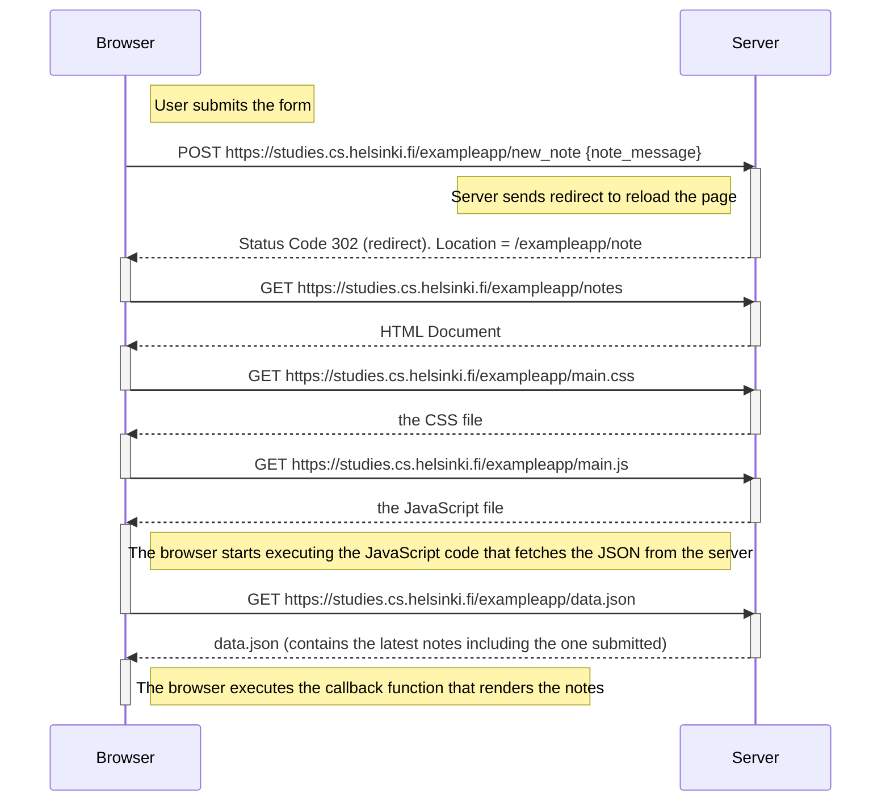

```mermaid
sequenceDiagram
    participant Browser
    participant Server

    Note right of Browser: User submits the form

    Browser->>Server: POST https://studies.cs.helsinki.fi/exampleapp/new_note {note_message}
    activate Server
    Note left of Server: Server sends redirect to reload the page
    Server-->>Browser: Status Code 302 (redirect). Location = /exampleapp/note
    deactivate Server

    activate Browser
    Browser->>Server: GET https://studies.cs.helsinki.fi/exampleapp/notes
    deactivate Browser
    activate Server
    Server-->>Browser: HTML Document
    deactivate Server

    activate Browser
    Browser->>Server: GET https://studies.cs.helsinki.fi/exampleapp/main.css
    deactivate Browser
    activate Server
    Server-->>Browser: the CSS file
    deactivate Server

    activate Browser
    Browser->>Server: GET https://studies.cs.helsinki.fi/exampleapp/main.js
    deactivate Browser
    activate Server
    Server-->>Browser: the JavaScript file
    deactivate Server

    activate Browser
    Note right of Browser: The browser starts executing the JavaScript code that fetches the JSON from the server    
    Browser->>Server: GET https://studies.cs.helsinki.fi/exampleapp/data.json
    deactivate Browser
    activate Server
    Server-->>Browser: data.json (contains the latest notes including the one submitted)
    deactivate Server

    activate Browser
    Note right of Browser: The browser executes the callback function that renders the notes
    deactivate Browser
```