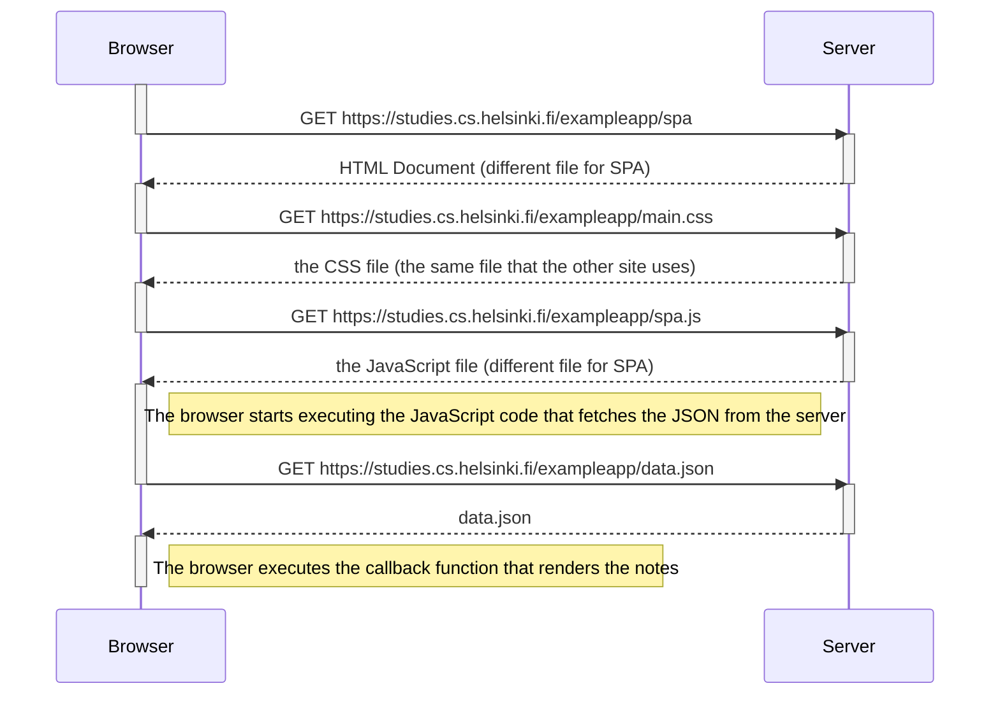

```mermaid
sequenceDiagram
    participant Browser
    participant Server

    activate Browser
    Browser->>Server: GET https://studies.cs.helsinki.fi/exampleapp/spa
    deactivate Browser
    activate Server
    Server-->>Browser: HTML Document (different file for SPA)
    deactivate Server

    activate Browser
    Browser->>Server: GET https://studies.cs.helsinki.fi/exampleapp/main.css
    deactivate Browser
    activate Server
    Server-->>Browser: the CSS file (the same file that the other site uses)
    deactivate Server

    activate Browser
    Browser->>Server: GET https://studies.cs.helsinki.fi/exampleapp/spa.js
    deactivate Browser
    activate Server
    Server-->>Browser: the JavaScript file (different file for SPA)
    deactivate Server

    activate Browser
    Note right of Browser: The browser starts executing the JavaScript code that fetches the JSON from the server    
    Browser->>Server: GET https://studies.cs.helsinki.fi/exampleapp/data.json
    deactivate Browser
    activate Server
    Server-->>Browser: data.json
    deactivate Server

    activate Browser
    Note right of Browser: The browser executes the callback function that renders the notes
    deactivate Browser


```