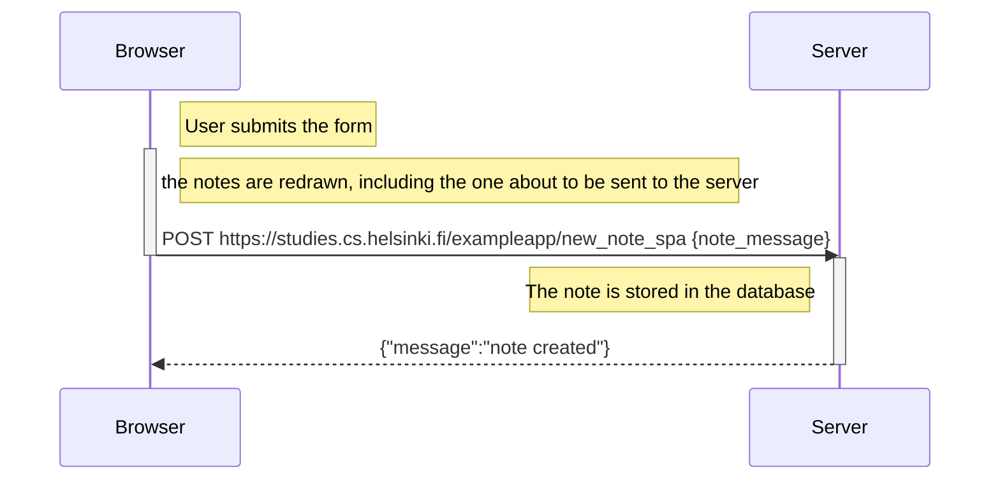

```mermaid
sequenceDiagram
    participant Browser
    participant Server
    

    Note right of Browser: User submits the form
    activate Browser
    Note right of Browser: the notes are redrawn, including the one about to be sent to the server

    Browser->>Server: POST https://studies.cs.helsinki.fi/exampleapp/new_note_spa {note_message}
    deactivate Browser
    activate Server
    Note left of Server: The note is stored in the database
    Server-->>Browser: {"message":"note created"}
    deactivate Server
```